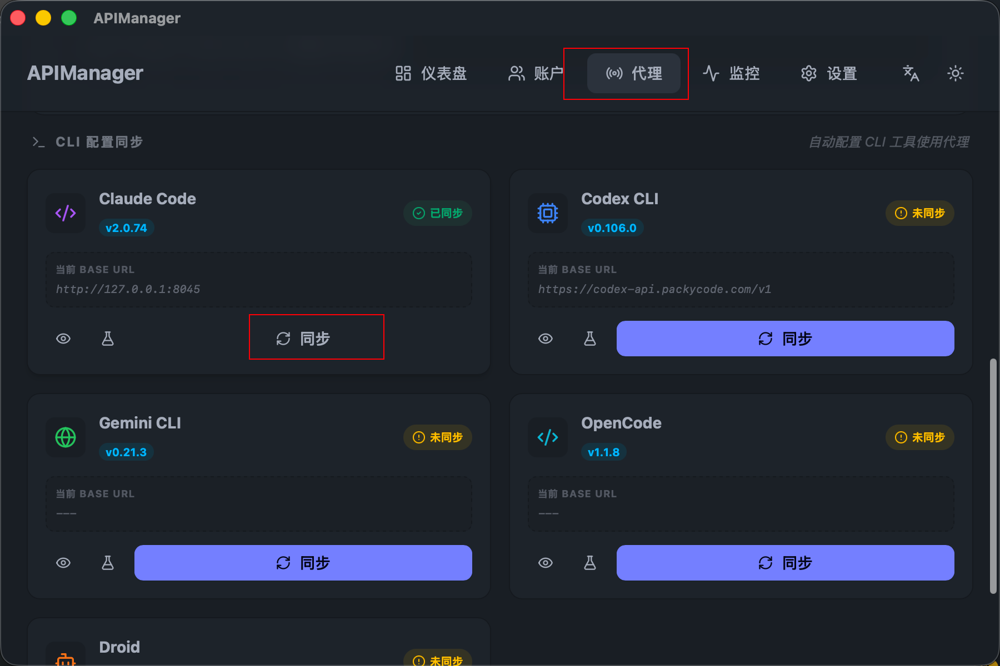
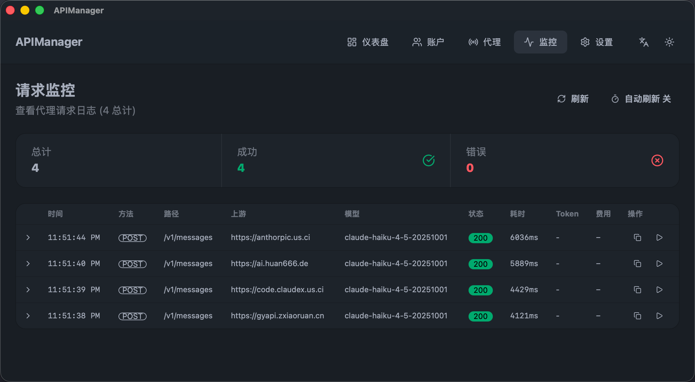

# APIManager

本地 AI API 聚合代理管理器，将多个 AI API 站点的账号统一管理，在本地启动代理服务，为 Claude Code、Codex CLI、Gemini CLI 等工具提供统一的 API 入口。


## 使用流程

从 Chrome [All API Hub](https://github.com/qixing-jk/all-api-hub) 扩展一键同步账号


应用 Claude Code的 配置


使用




## 功能特性

**账号管理**
- 支持多平台账号导入：New API、One API、Veloera、OneHub、DoneHub、Sub2API、AnyRouter、VoAPI、Super-API
- 从 Chrome [All API Hub](https://github.com/qixing-jk/all-api-hub) 扩展一键同步账号
- 导入 JSON 备份文件
- 账号优先级和权重配置

**本地代理服务**
- 兼容 OpenAI / Anthropic / Gemini API 协议
- 负载均衡：轮询、故障转移、随机、加权
- 熔断器：自动检测上游健康状态，隔离故障节点
- 模型路由：按规则将特定模型指向特定账号
- 模型别名：通配符匹配，灵活映射模型名称

**安全控制**
- API Key 认证（支持多用户独立密钥）
- 每用户额度限制（日限额 / 月限额 / 允许模型列表）
- IP 黑白名单
- 上游 SOCKS5 代理支持

**监控分析**
- 请求日志实时查看，支持展开详情
- 请求重放（Replay）
- 用量统计：请求数、Token 消耗、成本估算、成功率、延迟
- 24h 请求趋势图
- 每账号 / 每模型用量排行
- 预算控制（日 / 月成本上限）

**CLI 工具集成**
- 一键同步配置到 Claude Code、Codex CLI、Gemini CLI、OpenCode、Droid
- 自动检测已安装的 CLI 工具及版本
- 连接测试、配置查看、备份还原

**其他**
- 深色 / 浅色主题
- 中文 / English 双语
- 支持 GUI 模式和 Headless 模式（无窗口运行）

## 技术栈

| 层 | 技术 |
|---|---|
| 桌面框架 | [Tauri 2](https://tauri.app/) |
| 前端 | React 19 + TypeScript + Vite |
| 样式 | Tailwind CSS + DaisyUI |
| 后端 | Rust + Axum（HTTP 代理服务） |
| 数据库 | SQLite（安全规则）+ JSON（配置持久化） |
| HTTP 客户端 | reqwest（支持 SOCKS5） |

## 安装

前往 [Releases](https://github.com/zhalice2011/api-manager/releases) 下载对应平台安装包：

| 平台 | 架构 | 格式 |
|------|------|------|
| macOS | Apple Silicon | `.dmg` |
| macOS | Intel | `.dmg` |
| Windows | x64 | `.msi` / `.exe` |
| Linux | x64 | `.deb` / `.AppImage` / `.rpm` |

## 从源码构建

### 前置依赖

- [Rust](https://rustup.rs/)（stable）
- [Node.js](https://nodejs.org/) 20+
- [pnpm](https://pnpm.io/) 9+
- 系统依赖（仅 Linux）：
  ```bash
  sudo apt-get install -y libwebkit2gtk-4.1-dev build-essential curl wget file \
    libssl-dev libgtk-3-dev libayatana-appindicator3-dev librsvg2-dev patchelf \
    pkg-config libsoup-3.0-dev javascriptcoregtk-4.1 libjavascriptcoregtk-4.1-dev
  ```

### 开发

```bash
pnpm install
pnpm tauri dev
```

### 构建

```bash
pnpm tauri build
```

产物位于 `src-tauri/target/release/bundle/`。

### Headless 模式

通过环境变量启动无窗口代理服务：

```bash
ABV_HEADLESS=1 PORT=8080 ABV_API_KEY=your-key ABV_AUTH_MODE=strict ./apimanager
```

| 环境变量 | 说明 |
|---------|------|
| `ABV_HEADLESS` | 设为 `1` 启用无窗口模式 |
| `PORT` | 代理监听端口 |
| `ABV_API_KEY` | API 认证密钥 |
| `ABV_AUTH_MODE` | 认证模式（`off` / `strict` / `all_except_health` / `auto`） |
| `ABV_BIND_LOCAL_ONLY` | 设为 `true` 仅监听 localhost |

## 快速开始

1. 打开 APIManager，进入 **Accounts** 页面添加 API 账号
2. 进入 **Proxy** 页面，配置端口和负载均衡策略，点击 **Start**
3. 使用代理地址调用 API：

```bash
curl http://localhost:18090/v1/chat/completions \
  -H "Authorization: Bearer your-api-key" \
  -H "Content-Type: application/json" \
  -d '{
    "model": "gpt-4o",
    "messages": [{"role": "user", "content": "Hello"}]
  }'
```

4. 进入 **Settings** 页面，使用 CLI Sync 一键将代理配置同步到 Claude Code 等工具

## 项目结构

```
├── src/                    # React 前端
│   ├── pages/              # 页面组件（Dashboard/Accounts/Proxy/Monitor/Settings）
│   ├── components/         # 通用组件（Layout/CliSyncCard/ConfigEditorModal）
│   ├── hooks/              # 自定义 Hooks（useConfig/useLocale）
│   ├── locales/            # 国际化翻译文件
│   └── utils/              # 工具函数
├── src-tauri/              # Rust 后端
│   └── src/
│       ├── proxy/          # API 代理服务
│       │   ├── server.rs       # Axum HTTP 服务
│       │   ├── handlers/       # OpenAI/Anthropic/Gemini 协议处理
│       │   ├── middleware/     # 认证/CORS/IP过滤/监控
│       │   ├── token_manager.rs    # 负载均衡
│       │   ├── circuit_breaker.rs  # 熔断器
│       │   ├── model_router.rs     # 模型路由
│       │   └── monitor.rs         # 请求日志
│       ├── modules/        # 业务模块
│       │   ├── config.rs       # 配置持久化
│       │   ├── browser_storage.rs  # Chrome 扩展数据读取
│       │   ├── backup.rs      # 备份导入导出
│       │   └── security_db.rs # IP 黑白名单（SQLite）
│       ├── commands.rs     # Tauri IPC 命令
│       └── models.rs       # 数据结构定义
└── .github/workflows/      # CI/CD
    ├── build.yml           # Push main 自动构建
    └── release.yml         # Tag 触发 Release
```

## License

[MIT](LICENSE)
